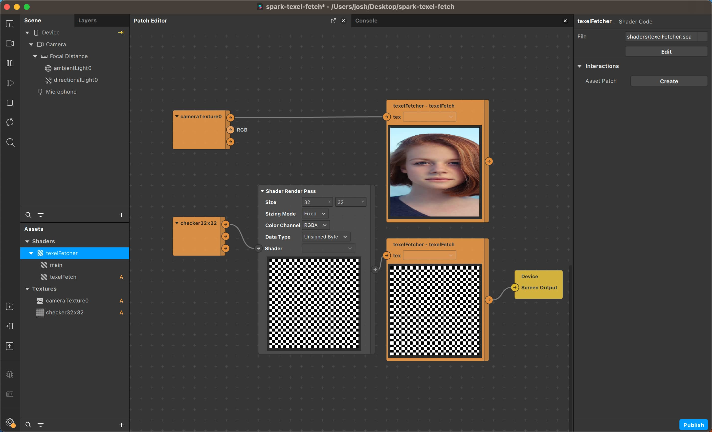

# SparkSL Texel Fetch

Creators porting shaders from [ShaderToy](https://shadertoy.com/) to [SparkSL](https://sparkar.facebook.com/ar-studio/learn/sparksl/sparksl-overview/) often need to convert [texelFetch](https://registry.khronos.org/OpenGL-Refpages/gl4/html/texelFetch.xhtml), which isn't available in SparkSL. 



## Download

[Download the demo project](https://github.com/positlabs/spark-texel-fetch/archive/refs/heads/master.zip)

## Copypasta

```
/*

  Implementation of texelFetch in SparkSL

*/
export vec4 texelFetch(std::Texture2d tex) {
  vec2 uv = std::getVertexTexCoord();
  vec2 rtSize = std::getRenderTargetSize();
  vec2 texelUV = floor(fragment(uv) * rtSize) / rtSize;
  return tex.sample(texelUV);
}

vec4 main (std::Texture2d tex){
  return texelFetch(tex);
}

```

## Incomplete Solution

While this works in some cases, it's not a complete replica of texelFetch. See Dennis Rossiev's comment on the [FB post](https://www.facebook.com/groups/metasparkcommunity/posts/1551951565216880/)

## Explanation

The benefit of texelFetch is that it samples discrete pixels and doesn’t blend anything together, so it’s more exact for situations that need pixel precision.

Since we don’t have native texelFetch in spark, we can fake it with a little bit of math.

Starting from the most basic way to sample textures in SparkSL, you will use the sample method of a std::Texture2d and pass in the UV from std::getVertexTexCoord()

yourTexture.sample(uv);

The next step is to make sure this is happening in the fragment shader (which deals in pixels), and not the vertex shader (which can only be as accurate as the number of vertices). So now our method call looks like this:

yourTexture.sample(fragment(uv));

But even though we are now in fragment / pixel space, your UV coordinates are a continuous value so there’s a chance that it will sample in between pixels and you’ll get an interpolated value. To prevent this, we need to essentially apply a pixelation shader onto our UV coordinates. We can get the pixel dimensions from from vec2 rtSize = std::getRenderTargetSize();, then slice our uv into pixels like this:

vec2 texelUV = floor(fragment(uv) * rtSize) / rtSize;

This method of multiplying, flooring, and dividing will make discrete pixels for us. Then we can finally sample our texels!

yourTexture.sample(texelUV);


## Donations

If you used this in client projects, or simply enjoyed making effects with my open-source projects, please consider a donation or sponsorship. One-time donations can be made with PayPal. Subscriptions can be through PayPal or Github Sponsors (click the heart sponsor button at the top of the page).

[](https://www.paypal.com/cgi-bin/webscr?cmd=_s-xclick&hosted_button_id=YGS69CHAE9EQC&source=url)
